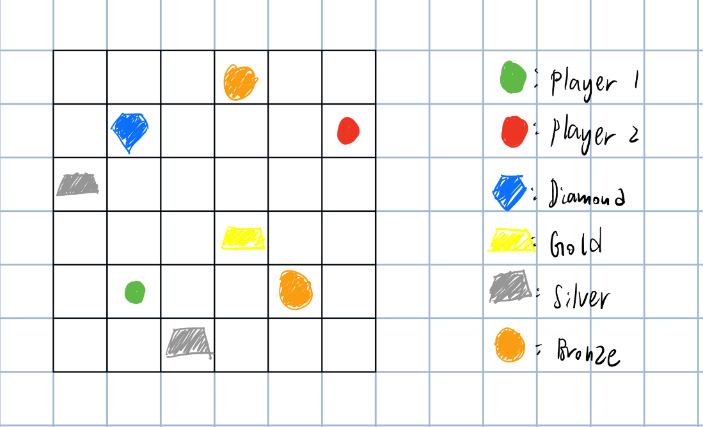

# COMP-2113-Group-5-Project -Golden Rush!

Group members: Kwok Ka Ho (3035689142), Lo Sai Kwan (3035686188)

## Description
Golden Rush! a competitive hunting game. Two game modes are available, 1 player vs. computer or PVP. The adventurers battle on a n x n square gameboard, Resources are generated randomly on it. Players can control their adeventurers and get the resources on the gameboard. Each type of resource (Diamond/Gold/Silver/Bronze) carries different points. The round ends once all the resources have been collected. The player who gets more points wins the round, the game will end once one of the player wins two games in total, and the winner will be the one who scores more in total(Note: winners are determined by their cumulated scores, you may still lose even if you have won two of the three rounds). The top scorers will be permanently stored in a scoreboard table.

Here is a table of the points carried by different resources:
Diamond: 100 points
Gold: 50 points
Silver: 20 points
Bronze: 10 points

Display Sample of gameboard:

## Features/Functions: (vis-a-vis 1-5 requirement) * Note: Code Requirements are represented in []

### Input header file(store the input functions in a seperated header file) [5]
   Features:
1) **Number of players (PVP/ Person vs. Computer), Username of the adventurers, Difficulty (easy/ hard)** [4]
     - Users can choose to play PVP(2 players), or PVC which has two mode to choose. 
     - Users input their usernames for counting scores in gameboard display and leaderboard purposes.
     - The easy mode will let the bot move randomly, while the hard mode will make the bot moves base on the AI algorithm.

2) **Player and Coordinate Structure** [2]
     - Player structure and Coordinate structure are made for the adventurers that contain players and resources attributes (Username, score, coordinates)
     
4) **board size** 
     - User can decide the gameboard size on their own (at least 5x5, at most 25x25)

### Process header file(store the process functions in a seperated header file) [5]
   Features:
1) **Who go first**[1]
     - Randomize who has the first move in the game for the sake of fairness.
     
2) **Scoring Update**
     - Scores of adventurer and computer will be updated after each move. 
     - Scores will be rewarded to adventurers who get to the places containing the resources.
     - Each type of resource contains different points.
     
3) **Randomize the resources and adventurer location** [1,3]
     - Number of resources will be randomized, ensuring there will be resources in the board.
     - Probability of the resources to appear depend on the rarity(points) of the resources.
     - e.g. diamond is the rarest and bronze is the most common.
     - Locations of adventurers and computer will also be randomize for the sake of fairness.
     
4) **Check Valid Movement** [3]
     - Check whether the movements of adventurer and computer are valid.
     - Adventurers should move to a valid direction where it does not go out of bound or to the same position as the other adventurer.

5) **Easy Mode**[1]
     - Randomize the movement of the computer.
 
6) **Hard Mode**[3]
     - AI algorithm is used in hard mode.
     - Target resource: the computer calculates a score for each available resource, then moves to the resources that maximize the chance of winning.
     
     
### Output header file (store the output functions in a seperated header file) [5]
   Features:
1) **Display Game Rules** [4]
     - Retrieve and display the game rules upon entering the main.
     - game rules are stored in a separate file ("gamerule.txt").

2) **Show round winner**
     - display the winner of the round.
     - display the cumulated scores of adventurers.

### Leaderboard header file (store the leaderboard functions in a seperated header file) [5]
   Features:
1) **Print Leaderboard** [4]
     - Print the all-time leaderboard after the game has ended.
     - Top 3 scores of adventurers winners would be stored permanently.  
     - Facilitate comparisions between high-level adventurers.
    
