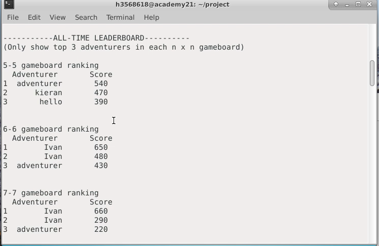
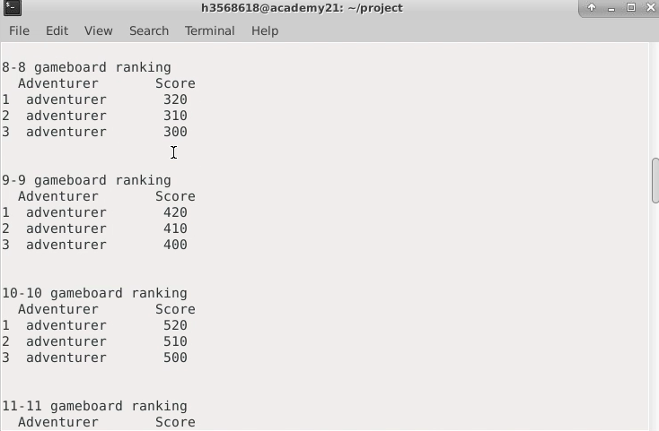
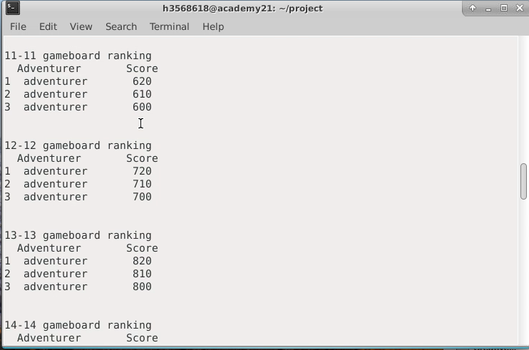
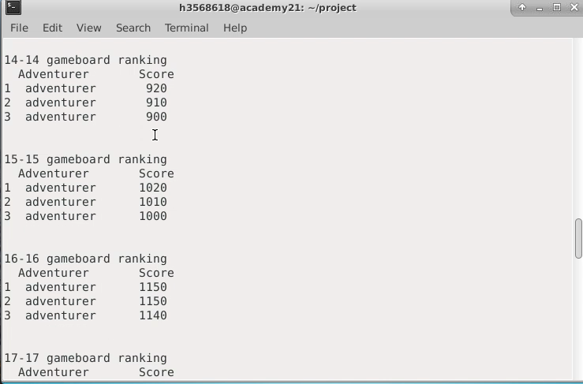
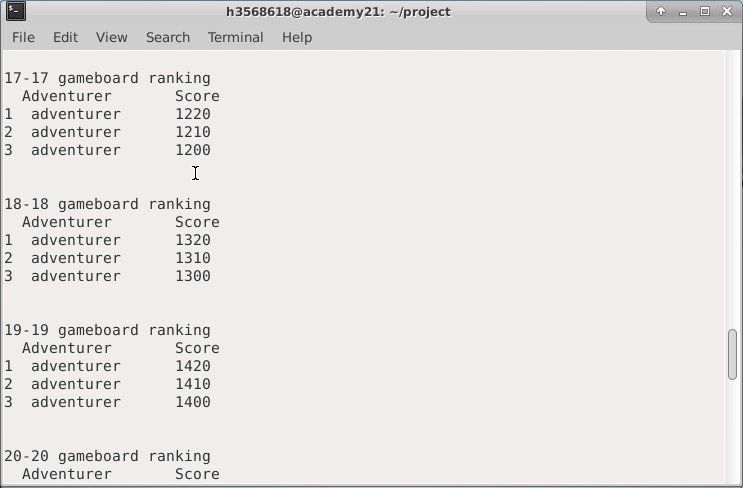
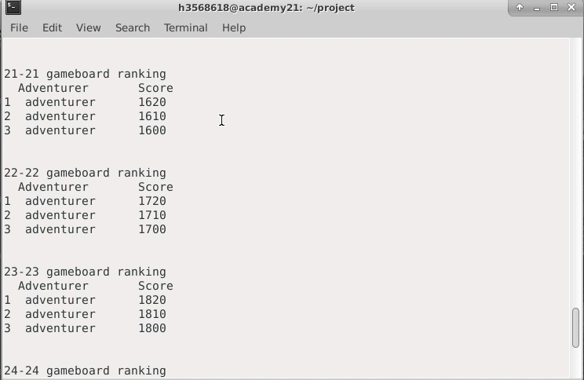
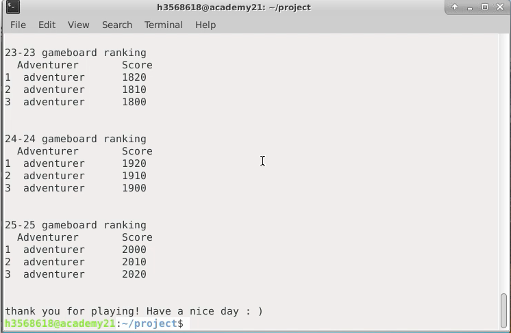

# Sample input/output
user inputs are shown in ***bold and italic***

### sample 1.1 (entering number of players, difficulty, username):

  How many player?(1/2) 
  ***1***  
  You are player 1 
  Please select the difficulty: easy / hard 
  ***hard*** 
  hard mode selected 
  Please input username: ***1***

### sample 1.2 (entering number of players, difficulty, username):

  How many player?(1/2) 
  ***2***  
  Please input username of player 1: ***player1*** 
  Please input username of player 2: ***player2*** 

### sample 2.1 (entering size of gameboard):

  Please enter a number n(5-25) to determine the size n x n board 
  ***5***
  
### sample 3.1 (entering movements of adventurer):
Move leftwards when user inputs 'a' 

### sample 3.2 (entering movements of adventurer):
Move rightwards when user inputs 'd' 

### sample 3.3 (entering movements of adventurer):
Move upwards when user inputs 'w' 

### sample 4 (finishing one round): 

  bot wins this round 
  Cumulated score(including this round):  
   
  1: 190 
  bot: 220 
   
  please press enter to continue 

### sample 5 (finishing whole game): 

  bot wins the game! 
  Do you want to check the Leaderboard?(y/n) 
  ***y*** 

### Sample 6 (updated Leaderboard.txt):
   540     adventurer      470     kieran  390     hello 
   650     Ivan    480     Ivan    430     adventurer 
   660     Ivan    290     Ivan    220     adventurer 
   320     adventurer      310     adventurer      300     adventurer 
   420     adventurer      410     adventurer      400     adventurer 
   520     adventurer      510     adventurer      500     adventurer 
   620     adventurer      610     adventurer      600     adventurer 
   720     adventurer      710     adventurer      700     adventurer 
   820     adventurer      810     adventurer      800     adventurer 
   920     adventurer      910     adventurer      900     adventurer 
  1020    adventurer      1010    adventurer      1000    adventurer 
  1150    adventurer      1150    adventurer      1140    adventurer 
  1220    adventurer      1210    adventurer      1200    adventurer 
  1320    adventurer      1310    adventurer      1300    adventurer 
  1420    adventurer      1410    adventurer      1400    adventurer 
  1520    adventurer      1510    adventurer      1500    adventurer 
  1620    adventurer      1610    adventurer      1600    adventurer 
  1720    adventurer      1710    adventurer      1700    adventurer 
  1820    adventurer      1810    adventurer      1800    adventurer 
  1920    adventurer      1910    adventurer      1900    adventurer 
  2000    adventurer      2010    adventurer      2020    adventurer 
